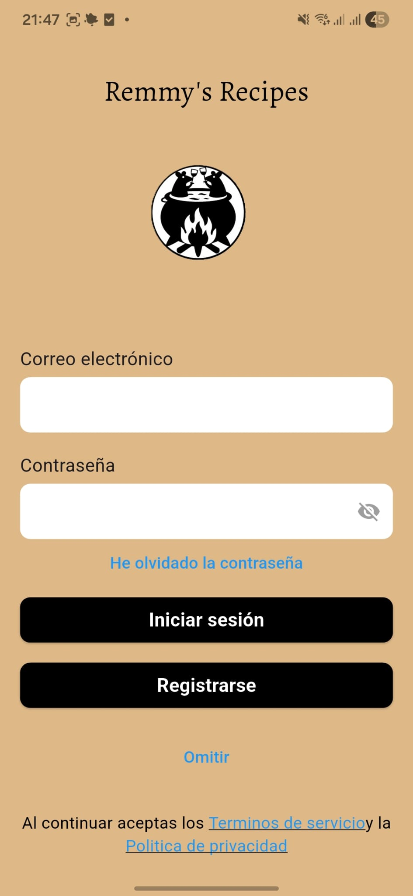
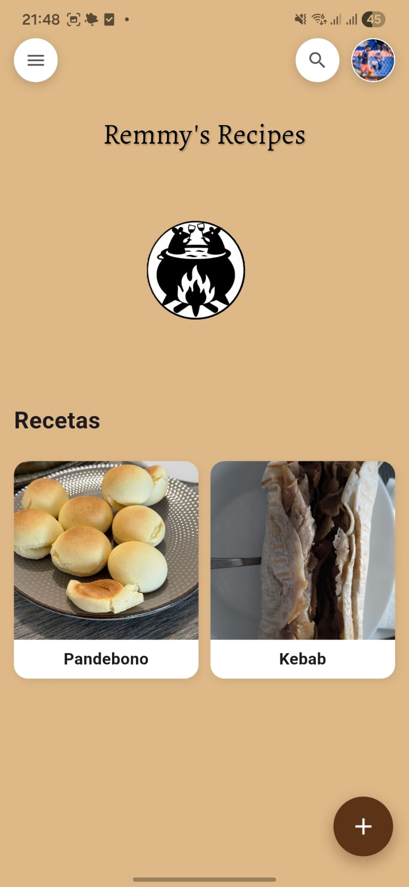
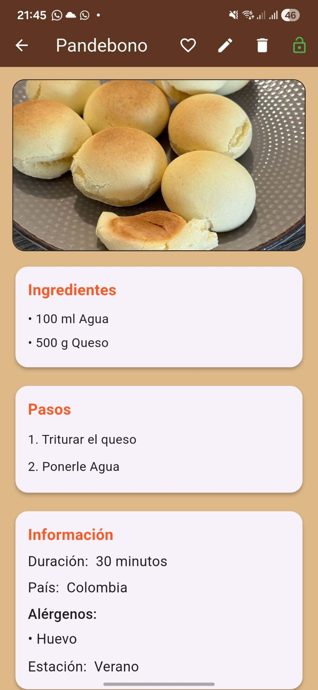
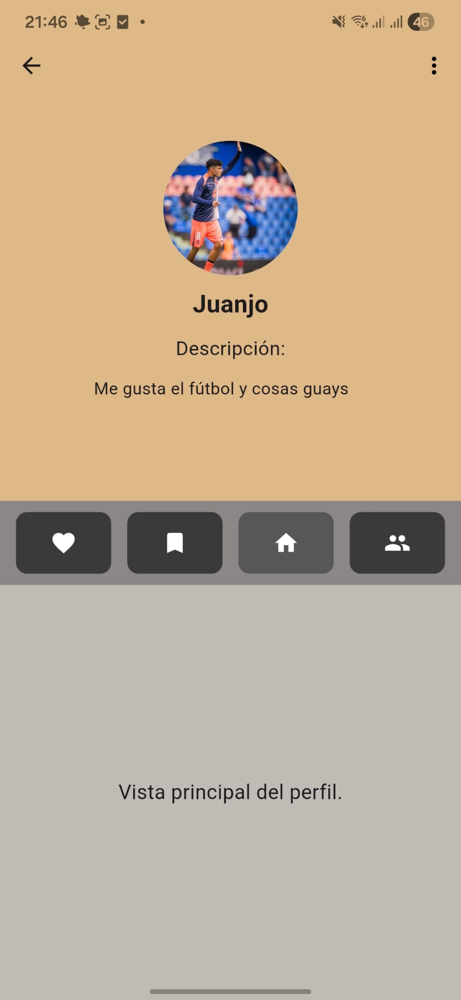

# 🍳 Remy's Recipes

> **Aplicación móvil multiplataforma para compartir y descubrir recetas gastronómicas**

Una plataforma social completa que permite a los usuarios crear, compartir, explorar y guardar recetas de todo el mundo. Desarrollada con **Flutter** en el frontend y **Node.js + Express** en el backend, con autenticación segura mediante **JWT** y gestión de usuarios en tiempo real.

---

## 🎯 Características Principales

### 👨‍🍳 Gestión de Recetas
- ✨ **CRUD Completo**: Crear, leer, actualizar y eliminar recetas
- 🔐 **Control de Privacidad**: Recetas públicas/privadas por usuario
- 🖼️ **Carga de Imágenes**: Soporte para imágenes de recetas con optimización
- 🏷️ **Metadatos Detallados**: Ingredientes, pasos, duración, país origen, alergenos, estación
- 🔍 **Filtrado Avanzado**: Buscar recetas por ingredientes, alergenos, país, estación
- ⏱️ **Rango de Paginación**: Sistema eficiente de paginación para exploración

### ❤️ Sistema de Favoritos
- ⭐ **Guardar Favoritos**: Marcar/desmarcar recetas favoritas
- 📋 **Ver Favoritos**: Acceso rápido a recetas guardadas
- 🔄 **Toggle Automático**: Añadir/eliminar con un clic

### 👤 Perfil y Comunidad
- 🎭 **Perfiles Personalizados**: Foto, nombre, país, descripción, año de nacimiento
- 📸 **Foto de Perfil**: Carga y gestión de imágenes de perfil
- 👥 **Sistema de Comunidad**: Explorar otros usuarios y sus recetas
- 📊 **Vista de Perfil**: Mostrar recetas propias, favoritos y estadísticas

### 🔑 Autenticación Segura
- 🛡️ **JWT (JSON Web Tokens)**: Autenticación sin estado y segura
- 💾 **Almacenamiento Seguro**: Tokens guardados en `flutter_secure_storage`
- ⏰ **Expiración de Sesión**: Tokens con tiempo de vida limitado (24 horas)
- 🔄 **Auto-login**: Verificación automática de sesión al arrancar
- 🚪 **Cierre de Sesión**: Limpieza completa de datos sensibles

### 🆘 Recuperación de Contraseña
- 📧 **Envío de Código**: Código de recuperación enviado por email
- ✅ **Verificación de Código**: Validación segura del código
- 🔑 **Reset Seguro**: Cambio de contraseña con token temporal

### 🌍 Internacionalización (i18n)
- 🇪🇸 **Español**: Interfaz completamente en español
- 🇬🇧 **Inglés**: Soporte multiidioma en backend
- 📱 **Detección Automática**: Selección de idioma según preferencias del dispositivo

### 🖼️ Gestión Inteligente de Imágenes
- 🎯 **ImageUrlHelper**: Construcción automática de URLs según plataforma
- 📱 **Soporte Multi-Plataforma**: Emulador, APK, Web
- 🔄 **Cache Busting**: Timestamps para forzar actualización de imágenes
- 🌐 **NGROK Support**: Funcionamiento en redes remotas con túneles

---

## 🏗️ Arquitectura del Proyecto

### Patrón Arquitectónico

```
FRONTEND (Flutter)                    BACKEND (Node.js/Express)
├─ Screens (UI)                       ├─ Routes (Express)
├─ Widgets (Componentes)              ├─ Controllers (Lógica)
├─ Services (Lógica)                  ├─ Models (Base de Datos)
├─ Utils (Helpers)                    ├─ Middleware (Auth, Upload)
└─ Data (Modelos)                     ├─ Config (DB)
                                      └─ i18n (Idiomas)
              ↓↓↓ HTTP + JWT ↓↓↓
                 API REST
```

### Stack Tecnológico

**Frontend:**
- 📱 **Flutter 3.x** - Framework multiplataforma
- 🎨 **Material Design** - Componentes visuales
- 📦 **HTTP** - Cliente HTTP para API REST
- 🔐 **flutter_secure_storage** - Almacenamiento seguro de tokens
- 📸 **image_picker** - Selección de imágenes
- 🌍 **flutter_localizations** - Soporte i18n
- 📊 **logger** - Sistema de logging estructurado
- 🔑 **dart:io** - Operaciones de archivo

**Backend:**
- 🚀 **Express.js** - Framework web
- 🗄️ **MySQL 8.x** - Base de datos relacional
- 🔐 **JWT** - Autenticación segura
- 📸 **Multer** - Carga de archivos en memoria
- 📧 **Nodemailer** - Envío de correos
- 🌍 **i18n** - Internacionalización
- 📊 **Winston** - Logging estructurado
- 🛡️ **CORS** - Compartición segura de recursos

---

## 📂 Estructura de Carpetas

```
Remmy-s_recipes/
│
├── Backend/                          # Servidor Node.js/Express
│   ├── config/
│   │   └── db.js                     # Configuración MySQL
│   ├── controllers/
│   │   ├── usuarioController.js      # Lógica de usuarios
│   │   └── recetaController.js       # Lógica de recetas
│   ├── middlewares/
│   │   ├── authMiddleware.js         # Verificación JWT
│   │   ├── authOpcional.js           # Auth opcional
│   │   └── upload.js                 # Multer config
│   ├── models/
│   │   ├── usuario.js                # Modelo Usuario
│   │   └── receta.js                 # Modelo Receta
│   ├── routes/
│   │   ├── usuarioRoutes.js          # Rutas de usuarios
│   │   ├── recetaRoutes.js           # Rutas de recetas
│   │   └── indexRoutes.js            # Rutas root
│   ├── i18n/
│   │   ├── es.js                     # Textos español
│   │   ├── en.js                     # Textos inglés
│   │   └── index.js                  # Detector de idioma
│   ├── .env                          # Variables de entorno
│   ├── package.json                  # Dependencias
│   ├── server.js                     # Entrada principal
│   └── logger.js                     # Sistema de logs
│
├── remy_recipes/                     # App Flutter
│   ├── lib/
│   │   ├── main.dart                 # Punto de entrada
│   │   ├── screens/
│   │   │   ├── login_screen.dart
│   │   │   ├── register_screen.dart
│   │   │   ├── home_screen.dart
│   │   │   ├── Profile_screen.dart
│   │   │   ├── DetalleRecetaPage.dart
│   │   │   ├── recipes_form_page.dart
│   │   │   ├── community_screen.dart
│   │   │   ├── EditProfileScreen.dart
│   │   │   └── forgot_password_*.dart
│   │   ├── services/
│   │   │   ├── auth_service.dart
│   │   │   ├── recetas_service.dart
│   │   │   ├── session_manager.dart
│   │   │   ├── api_headers_helper.dart
│   │   │   └── config.dart
│   │   ├── data/
│   │   │   ├── models/
│   │   │   │   ├── usuario.dart
│   │   │   │   └── receta.dart
│   │   │   └── constants/
│   │   ├── utils/
│   │   │   ├── image_url_helper.dart      # Helper de URLs
│   │   │   └── validators.dart
│   │   ├── widgets/
│   │   │   ├── session_expired_dialog.dart
│   │   │   └── cargar_mas_button.dart
│   │   ├── core/
│   │   │   └── config/
│   │   │       └── env_config.dart
│   │   └── l10n/
│   │       ├── app_localizations.dart
│   │       └── app_es.arb
│   ├── pubspec.yaml                  # Dependencias Flutter
│   ├── .env.development
│   ├── .env.production               # Config con NGROK
│   └── analysis_options.yaml
│
└── README.md                         # Este archivo

```

---

## Instalación Paso a Paso

### Requisitos Previos

- **Node.js** v18+ y npm
- **Flutter** 3.9.2+
- **Dart** 3.9.2+
- **MySQL** 8.0+
- **Git** (opcional)

### 1️⃣ Clonar el Repositorio

```bash
# Con SSH
git clone git@github.com:zesar5/remy-recipes.git
cd Remmy-s_recipes

# Con HTTPS
git clone https://github.com/zesar5/remy-recipes.git
cd Remmy-s_recipes
```

### 2️⃣ Configurar Base de Datos

#### Crear Base de Datos MySQL

```sql
-- Crear base de datos
CREATE DATABASE IF NOT EXISTS remy_recipes CHARACTER SET utf8mb4;
USE remy_recipes;

-- Tabla de usuarios
CREATE TABLE usuario (
  Id_usuario INT PRIMARY KEY AUTO_INCREMENT,
  nombre VARCHAR(100) UNIQUE NOT NULL,
  email VARCHAR(100) UNIQUE NOT NULL,
  contrasena VARCHAR(255) NOT NULL,
  pais VARCHAR(100),
  descripcion TEXT,
  anioNacimiento INT,
  creado_en TIMESTAMP DEFAULT CURRENT_TIMESTAMP
);

-- Tabla de recetas
CREATE TABLE receta (
  Id_receta INT PRIMARY KEY AUTO_INCREMENT,
  titulo VARCHAR(200) NOT NULL,
  tiempo_preparacion INT,
  origen VARCHAR(100),
  alergenos TEXT,
  estacion VARCHAR(50),
  publica BOOLEAN DEFAULT TRUE,
  ingredientes JSON,
  pasos JSON,
  Id_usuario INT NOT NULL,
  creado_en TIMESTAMP DEFAULT CURRENT_TIMESTAMP,
  FOREIGN KEY (Id_usuario) REFERENCES usuario(Id_usuario) ON DELETE CASCADE
);

-- Tabla de imágenes de receta
CREATE TABLE receta_imagen (
  Id_imagen INT PRIMARY KEY AUTO_INCREMENT,
  Id_receta INT NOT NULL,
  imagen LONGBLOB NOT NULL,
  FOREIGN KEY (Id_receta) REFERENCES receta(Id_receta) ON DELETE CASCADE
);

-- Tabla de imágenes de usuario
CREATE TABLE usuario_imagen (
  Id_imagen INT PRIMARY KEY AUTO_INCREMENT,
  Id_usuario INT NOT NULL,
  imagen LONGBLOB NOT NULL,
  UNIQUE KEY (Id_usuario),
  FOREIGN KEY (Id_usuario) REFERENCES usuario(Id_usuario) ON DELETE CASCADE
);

-- Tabla de favoritos
CREATE TABLE favorito (
  Id_favorito INT PRIMARY KEY AUTO_INCREMENT,
  Id_usuario INT NOT NULL,
  Id_receta INT NOT NULL,
  creado_en TIMESTAMP DEFAULT CURRENT_TIMESTAMP,
  UNIQUE KEY (Id_usuario, Id_receta),
  FOREIGN KEY (Id_usuario) REFERENCES usuario(Id_usuario) ON DELETE CASCADE,
  FOREIGN KEY (Id_receta) REFERENCES receta(Id_receta) ON DELETE CASCADE
);

-- Tabla de recuperación de contraseña
CREATE TABLE usuario_recuperacion (
  Id_recuperacion INT PRIMARY KEY AUTO_INCREMENT,
  Id_usuario INT NOT NULL,
  codigo_recuperacion VARCHAR(10),
  fecha_expiracion DATETIME,
  FOREIGN KEY (Id_usuario) REFERENCES usuario(Id_usuario) ON DELETE CASCADE
);
```

### 3️⃣ Configurar Backend

```bash
cd Backend

# Instalar dependencias
npm install

# Crear archivo .env
cat > .env << EOF
# Base de Datos
DB_HOST=localhost
DB_USER=root
DB_PASS=
DB_NAME=remysrecipes_imgurl

# JWT
JWT_SECRET=super_clave_ultra_secreta_123

# Email (para recuperación de contraseña)
EMAIL_USER=remmysrecipesnoreply@gmail.com
EMAIL_PASS=mukemuattjtzzzlm

# Port
PORT=8000
EOF

# Iniciar servidor
npm start
# O en desarrollo con nodemon:
npm run dev
```

**Salida esperada:**
```
Servidor corriendo en http://localhost:8000
```

### 4️⃣ Configurar Frontend (Flutter)

```bash
cd remy_recipes

# Obtener dependencias
flutter pub get

# Crear archivos de localización
flutter gen-l10n

# Ejecutar en emulador/dispositivo
flutter run
```

**En caso de problemas:**
```bash
# Limpiar caché
flutter clean
flutter pub get

# Ejecutar con logs detallados
flutter run -v
```

---

## 🔧 Configuración

### Variables de Entorno - Backend (.env)

```env
# 🗄️ MYSQL
DB_HOST=localhost            # Host del servidor MySQL
DB_USER=root                 # Usuario de MySQL
DB_PASS=tu_contraseña        # Contraseña de MySQL
DB_NAME=remy_recipes         # Nombre de la base de datos

# 🔐 JWT
JWT_SECRET=tu_clave_super_segura_123!@#  # Clave para firmar tokens
JWT_EXPIRES_IN=24h           # Expiración del token

# EMAIL (Recuperación de contraseña)
EMAIL_USER=tu_email@gmail.com            # Email de la app
EMAIL_PASS=tu_app_password_aqui          # Contraseña de app (no la cuenta)

# SERVER
PORT=8000                    # Puerto de escucha
NODE_ENV=development         # development | production

# CORS
CORS_ORIGIN=*               # Orígenes permitidos
```

### Variables de Entorno - Frontend (.env.production)

```env
# API BASE URL
API_BASE_URL=https://dena-predependent-dudley.ngrok-free.dev
API_TIMEOUT=30000
ALLOW_BAD_CERTIFICATES=false
```

**Nota:** El archivo `.env.development` usa direcciones locales (10.0.2.2:8000 para emulador).

---

## 🎮 Cómo Ejecutar el Proyecto

### 🖥️ Opción 1: Emulador Android

```bash
# Terminal 1: Backend
cd Backend
npm start

# Terminal 2: Flutter (emulador conectado)
cd remy_recipes
flutter run
```

### 📱 Opción 2: Dispositivo Físico

```bash
# 1. Obtén tu IP local
ipconfig  # Windows
ifconfig  # macOS/Linux

# 2. Actualiza config.dart con tu IP
# const String baseUrl = 'http://192.168.1.XX:8000';

# 3. Backend (en la máquina con IP XX)
cd Backend
npm start

# 4. Frontend (en el dispositivo)
flutter run --release
```

### 🌐 Opción 3: Con NGROK (Acceso Remoto)

```bash
# Terminal 1: Backend
cd Backend
npm start

# Terminal 2: NGROK (en otra terminal)
ngrok http 8000
# Copia la URL: https://xxxx-xxx-xxx-xxx.ngrok-free.dev

# Terminal 3: Actualiza .env.production
API_BASE_URL=https://xxxx-xxx-xxx-xxx.ngrok-free.dev

# Terminal 4: Flutter
cd remy_recipes
flutter run --release
```

### 🏗️ Compilar APK para Producción

```bash
cd remy_recipes

# Build APK release
flutter build apk --release

# Build bundle para Play Store
flutter build appbundle --release

# El APK estará en:
# build/app/outputs/flutter-apk/app-release.apk
```

---

## 🌐 Cómo Usar NGROK

**NGROK** permite exponer tu servidor local a internet de forma segura. Perfecto para testing remoto.

### Instalación

```bash
# Descargar desde https://ngrok.com/download
# O con package manager:
brew install ngrok  # macOS
choco install ngrok # Windows
scoop install ngrok # Windows (alternativa)
```

### Uso

```bash
# 1. Exponer el servidor local
ngrok http 8000

# 2. La salida será similar a:
# Session Status       online
# Account             free
# Version             3.3.0
# Region              us (United States)
# Latency             45ms
# Web Interface       http://127.0.0.1:4040
# Forwarding          https://xxxx-xxxx-xxxx.ngrok-free.dev -> http://localhost:8000

# 3. Copia la URL HTTPS y úsala en tu app
```

### Ventajas
✅ Testing desde dispositivo real sin WiFi local  
✅ Acceso público temporal para demostración  
✅ Inspector de requests en tiempo real  
✅ Muy útil para desarrollo colaborativo

---

## 📡 API REST - Endpoints

❌ = PÚBLICO → Cualquiera puede usar estos endpoints sin token (login, registro, recuperar contraseña)

✅ = PROTEGIDO → Necesitas enviar el token JWT en el header para usar estos endpoints (solo usuarios autenticados)

### 🔐 Autenticación

| Método | Endpoint | Descripción | Auth |
|--------|----------|-------------|------|
| `POST` | `/usuarios/login` | Login con email y contraseña | ❌ |
| `POST` | `/usuarios/registro` | Crear nueva cuenta | ❌ |
| `GET` | `/usuarios/perfil/:id` | Obtener perfil de usuario | ❌ |
| `POST` | `/usuarios/forgot-password` | Enviar código de recuperación | ❌ |
| `POST` | `/usuarios/verify-reset-code` | Verificar código de recuperación | ❌ |
| `POST` | `/usuarios/reset-password` | Cambiar contraseña | ❌ |

### 👥 Usuarios

| Método | Endpoint | Descripción | Auth |
|--------|----------|-------------|------|
| `GET` | `/usuarios` | Listar todos los usuarios | ❌ |
| `GET` | `/usuarios/comunidad` | Usuarios de la comunidad (con fotos) | ❌ |
| `GET` | `/usuarios/foto/:id` | Obtener foto de perfil | ❌ |
| `POST` | `/usuarios/foto/:id` | Subir foto de perfil | ✅ |
| `PUT` | `/usuarios/perfil/:id` | Actualizar perfil | ✅ |

### 🍳 Recetas

| Método | Endpoint | Descripción | Auth |
|--------|----------|-------------|------|
| `GET` | `/recetas` | Obtener recetas por rango | ❌ |
| `GET` | `/recetas/publicas` | Todas las recetas públicas | ❌ |
| `GET` | `/recetas/:id` | Obtener receta pública por ID | ❌ |
| `GET` | `/recetas/usuario/:userId` | Recetas de un usuario (sus+públicas) | ✅ |
| `POST` | `/recetas` | Crear receta | ✅ |
| `PUT` | `/recetas/:id` | Actualizar receta | ✅ |
| `DELETE` | `/recetas/:id` | Eliminar receta | ✅ |
| `PUT` | `/recetas/:id/privacidad` | Cambiar privacidad receta | ✅ |
| `POST` | `/recetas/filtrar` | Recetas filtradas | ❌ |

### ⭐ Favoritos

| Método | Endpoint | Descripción | Auth |
|--------|----------|-------------|------|
| `GET` | `/recetas/favoritos` | Obtener mis favoritos | ✅ |
| `POST` | `/recetas/favoritos/:id` | Añadir a favoritos | ✅ |
| `DELETE` | `/recetas/favoritos/:id` | Eliminar de favoritos | ✅ |
| `GET` | `/recetas/favoritos/:id/check` | Verificar si es favorito | ✅ |
| `POST` | `/recetas/favoritos/:id/toggle` | Toggle automático favorito/no-favorito | ✅ |

---

## 🔑 Gestión de Autenticación

### Flujo de Login

```
1. Usuario escribe email + contraseña
2. Frontend envía POST /usuarios/login
3. Backend valida en MySQL
4. Backend genera JWT (24 horas)
5. Frontend almacena en flutter_secure_storage
6. Requests posteriores incluyen: Authorization: Bearer <token>
7. Backend verifica JWT en authMiddleware
```

### Estructura del JWT

```json
{
  "header": {
    "alg": "HS256",
    "typ": "JWT"
  },
  "payload": {
    "id": 1,
    "iat": 1715766540,
    "exp": 1715852940
  },
  "signature": "..."
}
```

### Seguridad

✅ Tokens con expiración de 24 horas  
✅ Almacenamiento seguro en flutter_secure_storage  
✅ Validación en cada request protegido  
✅ Limpieza automática al logout  
✅ Detección de sesión expirada  

---

## 🖼️ Gestión de Imágenes

### Estrategia de Carga Inteligente

El helper `ImageUrlHelper` decide automáticamente qué URL usar:

```dart
// ✅ En Emulador (Debug)
http://10.0.2.2:8000/uploads/recetas/image.jpg?t=1234567

// ✅ En APK (Release)
https://dena-predependent-dudley.ngrok-free.dev/uploads/recetas/image.jpg?t=1234567

// ✅ En Web
https://api.ejemplo.com/uploads/recetas/image.jpg?t=1234567
```

### Características

| Feature | Detalle |
|---------|---------|
| 📸 **Tipos Soportados** | JPEG, PNG, GIF, WebP |
| 💾 **Límite de Tamaño** | 10MB máximo |
| 🎯 **Almacenamiento** | Base de datos (BLOB) |
| ⚡ **Cache Busting** | Timestamp automático |
| 🔄 **Multi-Plataforma** | Emulador, APK, Web |
| 🌐 **NGROK Support** | Funcionamiento remoto |

### Endpoints de Imágenes

```
POST   /usuarios/foto/:id          # Subir foto de perfil
GET    /usuarios/foto/:id          # Descargar foto de perfil
POST   /recetas                    # Crear receta (incluye imagen)
GET    /recetas/:id                # Obtener receta (con imagen en JSON)
```

---

## 🎨 Pantallas de la Aplicación

### Estructura de Navegación

```
┌─ LoginScreen
│  └─ RegisterScreen
├─ HomeScreen ──┐
│  ├─ DetalleRecetaPage
│  └─ RecipesFormPage (crear receta)
├─ ProfileScreen ──┐
│  ├─ EditProfileScreen
│  └─ DetalleRecetaPage
├─ CommunityScreen (explorar usuarios)
└─ ForgotPasswordFlow
   ├─ ForgotPasswordEmailScreen
   ├─ ForgotPasswordCodeScreen
   └─ ForgotPasswordNewPasswordScreen
```

### Descripción de Pantallas

| Pantalla | Descripción | Features |
|----------|-------------|----------|
| **LoginScreen** | Autenticación de usuario | Login con email, registro rápido |
| **RegisterScreen** | Crear nueva cuenta | Validación de campos, términos |
| **HomeScreen** | Descubrimiento de recetas | Grid de recetas públicas, búsqueda |
| **DetalleRecetaPage** | Detalle completo de receta | Ingredientes, pasos, favoritear |
| **ProfileScreen** | Perfil del usuario actual | Recetas propias, favoritos, estadísticas |
| **EditProfileScreen** | Editar datos de perfil | Cambiar foto, descripción, datos personales |
| **RecipesFormPage** | Crear/editar receta | Formulario completo, subir imagen |
| **CommunityScreen** | Explorar comunidad | Listar usuarios, ver perfiles |
| **TermsScreen** | Términos y condiciones | Lectura durante registro |
| **ForgotPassword** | 3 pantallas para recuperación | Email → Código → Nueva contraseña |

---

## 📊 Modelos de Datos

### Usuario

```dart
class Usuario {
  int id;                      // ID único
  String userName;             // Nombre de usuario único
  String email;                // Email único
  String? fotoPerfil;          // URL foto de perfil
  String? descripcion;         // Biografía
  String? pais;                // País
  int? anioNacimiento;         // Año de nacimiento
  DateTime creadoEn;           // Timestamp de creación
}
```

### Receta

```dart
class Receta {
  int? id;
  String titulo;
  String? imagenUrl;           // Path de imagen
  int? tiempoPreparacion;      // Minutos
  String? origen;              // País de origen
  String? alergenos;           // Ej: "gluten,lactosa"
  String? estacion;            // Ej: "invierno"
  bool publica;                // true = pública, false = privada
  List<String> ingredientes;
  List<String> pasos;
  int idUsuario;
  String? creadorNombre;
  DateTime? creadoEn;
}
```

### Favorito

```dart
class Favorito {
  int idFavorito;
  int idUsuario;
  int idReceta;
  DateTime creadoEn;
}
```

---

## 🐛 Problemas Comunes y Soluciones

### ❌ Error: "Connection refused" al conectar Backend

```
Problema: El backend no está corriendo
Solución:
  1. Verifica que el puerto 8000 esté libre: netstat -ano | findstr :8000
  2. Inicia backend: cd Backend && npm start
  3. Verifica en http://localhost:8000
```

### ❌ Error: "Imagen no carga en APK"

```
Problema: ImageUrlHelper usa URL incorrecta
Solución:
  1. Verifica .env.production con URL NGROK correcta
  2. Limpia Flutter: flutter clean
  3. Recompila APK: flutter build apk --release
  4. Reinstala en dispositivo
```

### ❌ Error: "MySQL connection error"

```
Problema: Base de datos no accesible
Solución:
  1. Verifica que MySQL está corriendo
  2. Valida .env con credenciales correctas
  3. Verifica que la BD existe: CREATE DATABASE remy_recipes;
  4. Reinicia el backend
```

### ❌ Error: "Token expirado" al hacer petición

```
Problema: JWT vencido (24 horas)
Solución:
  1. El app debe hacer logout automático
  2. Mostrar diálogo de sesión expirada
  3. Redirigir a login
  (Esto está implementado en SessionManager)
```

### ❌ Error: "CORS error" en requests

```
Problema: Backend rechaza peticiones
Solución:
  1. Verifica que CORS está habilitado en server.js
  2. Verifica el header Accept-Language es correcto
  3. Limpia caché: flutter clean
  4. Reinicia el backend
```

### ❌ Error: "Foto de perfil no carga"

```
Problema: ImageUrlHelper no está siendo usado en Profile_screen
Solución:
  1. Verifica que _buildHeader() usa ImageUrlHelper.buildImageUrl()
  2. Limpia caché: flutter clean && flutter pub get
  3. Recompila: flutter run
```

---

## 🎯 Posibles Mejoras Futuras

### 🚀 Phase 2 - Sistema Social
- [ ] Sistema de amigos/seguidores
- [ ] Compartir recetas en redes sociales
- [ ] Notificaciones en tiempo real (Firebase)
- [ ] Chat entre usuarios
- [ ] Valoraciones y comentarios en recetas

### 📊 Phase 3 - Recomendaciones IA
- [ ] Motor de recomendaciones (favoritos + comportamiento)
- [ ] Búsqueda semántica (similitud de ingredientes)
- [ ] Sugerencias personalizadas
- [ ] Detección de alergenos automática

### 🎮 Phase 4 - Gamificación
- [ ] Sistema de puntos/logros
- [ ] Retos culinarios
- [ ] Leaderboards
- [ ] Badges y trofeos
- [ ] Eventos especiales

### 📅 Phase 5 - Planificación
- [ ] Planificador de menús semanal
- [ ] Generador de lista de compras
- [ ] Integración con tiendas online
- [ ] Cálculo de calorías/macronutrientes

### 📱 Phase 6 - Plataformas
- [ ] Web app (React/Vue)
- [ ] App para iOS nativa
- [ ] Desktop (Windows/macOS)
- [ ] Soporte offline

### 🔐 Phase 7 - Seguridad & Escalabilidad
- [ ] Refresh tokens
- [ ] Rate limiting
- [ ] HTTPS/SSL
- [ ] Backup automático
- [ ] CDN para imágenes
- [ ] Base de datos replicada

---

## 📦 Dependencias Importantes

### Backend

```json
{
  "express": "^5.2.1",           // Framework web
  "jsonwebtoken": "^9.0.3",      // JWT authentication
  "bcrypt": "^5.x.x",            // Password hashing
  "mysql2": "^3.15.3",           // MySQL driver
  "multer": "^2.0.2",            // File uploads
  "nodemailer": "^8.0.1",        // Email sending
  "cors": "^2.8.5",              // CORS handling
  "dotenv": "^17.2.3",           // Environment variables
  "winston": "^3.19.0"           // Logging
}
```

### Frontend

```yaml
dependencies:
  flutter:
    sdk: flutter
  http: ^1.2.1                   # HTTP client
  logger: ^2.0.2+1               # Logging
  flutter_secure_storage: ^10.0.0 # Secure token storage
  image_picker: ^1.1.0           # Image selection
  permission_handler: ^12.0.1    # Permissions
  flutter_localizations:         # i18n
    sdk: flutter
  flutter_dotenv: ^5.1.0         # Environment variables
  intl: ^0.20.2                  # Internationalization
  cupertino_icons: ^1.0.8        # iOS icons
```

---

## 📸 Capturas de Pantalla

> **[Placeholder: ]**
> **[Placeholder: ]**
> **[Placeholder: ]**
> **[Placeholder: ]**

---

## 🤝 Contribuir

Las contribuciones son muy bienvenidas. Para cambios principales:

1. **Fork** el repositorio
2. **Crea** una rama para tu feature (`git checkout -b feature/AmazingFeature`)
3. **Commit** tus cambios (`git commit -m 'Add some AmazingFeature'`)
4. **Push** a la rama (`git push origin feature/AmazingFeature`)
5. **Abre** un Pull Request

### Estándares de Código

- ✅ Flutter: Seguir Google Flutter conventions
- ✅ Backend: Usar camelCase para variables, PascalCase para clases
- ✅ Commits: Mensajes claros en español o inglés
- ✅ Documentación: Comentar funciones complejas

---

## 📄 Licencia

Este proyecto está bajo la licencia **MIT** - ver el archivo [LICENSE](LICENSE) para más detalles.

```
MIT License

Copyright (c) 2024 Remy's Recipes

Permission is hereby granted, free of charge, to any person obtaining a copy
of this software and associated documentation files (the "Software"), to deal
in the Software without restriction, including without limitation the rights
to use, copy, modify, merge, publish, distribute, sublicense, and/or sell
copies of the Software, and to permit persons to whom the Software is
furnished to do so, subject to the following conditions:
```

---

## 👨‍💻 Autores

- Aroca Manzano Rubén
- 🐙 GitHub: [@Ruben7312](https://github.com/Ruben7312)
- 💼 LinkedIn: [Rubén Aroca](https://linkedin.com/in/ruben-aroca-7622b8348)
- 📧 Email: arocamanzanoruben@gmail.com

- Bedoya Isaza Juan José
- 🐙 GitHub: [@Juan-Bedoya20](https://github.com/Juan-Bedoya20)
- 💼 LinkedIn: [Juan Bedoya](https://linkedin.com/in/juan-bedoya-5804a9313)
- 📧 Email: juanjos0306@gmail.com

- Melero Valera César
- 🐙 GitHub: [@zesar5](https://github.com/zesar5)
- 💼 LinkedIn: [César Melero Valera](https://linkedin.com/in/césar-melero-valera-11245a349)
- 📧 Email: cesarovich12@gmail.com

---

## 📞 Soporte

¿Tienes preguntas o problemas?

- 📖 Revisa la sección de [Problemas Comunes](#-problemas-comunes-y-soluciones)
- 🐛 Reporta bugs en [Issues](https://github.com/zesar5/remy-recipes/issues)
- 💬 Contacta al equipo de desarrollo

---

## 🙏 Agradecimientos

- 💡 Inspiración en aplicaciones de recetas populares
- 🎨 Diseño basado en Material Design
- 📚 Documentación de Flutter y Express
- 🤝 Comunidad Flutter y Node.js

---

<div align="center">

### ⭐ Si te gusta este proyecto, ¡por favor dale una estrella! ⭐

Hecho con ❤️ por el equipo de Remmy's Recipes

[⬆ Volver al inicio](#-remys-recipes)

</div>
